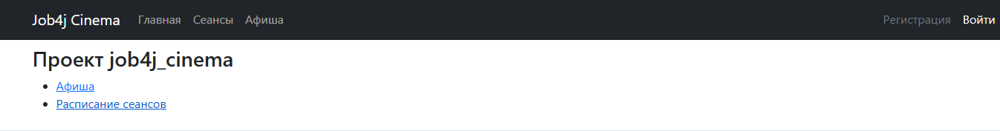
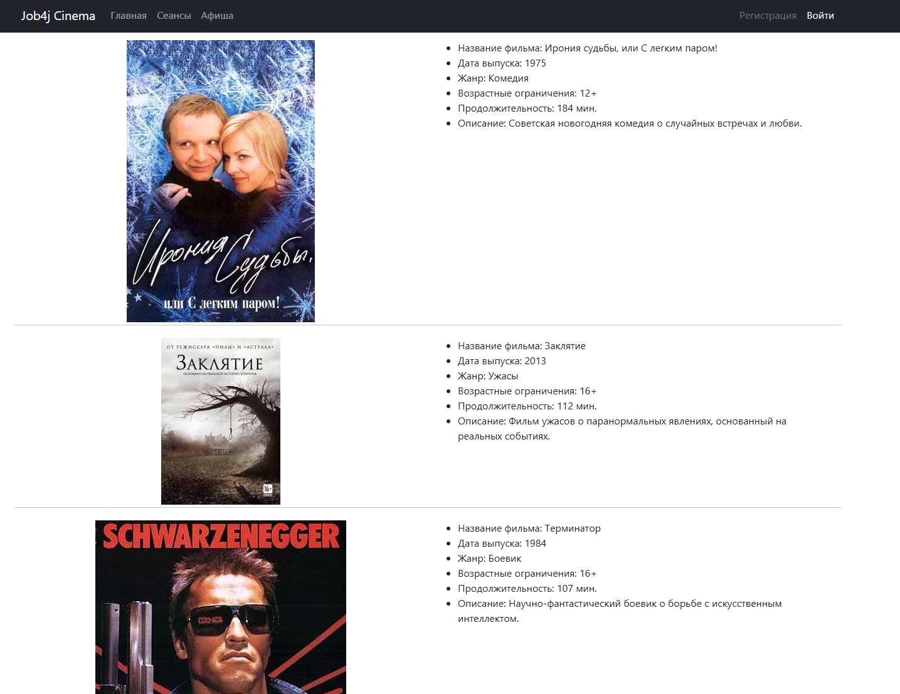
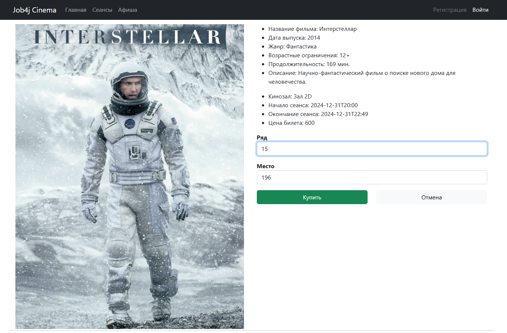
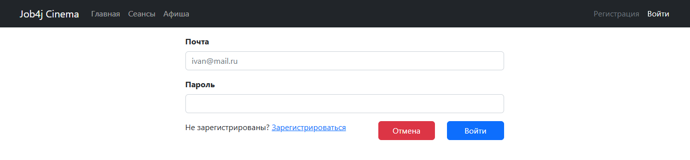
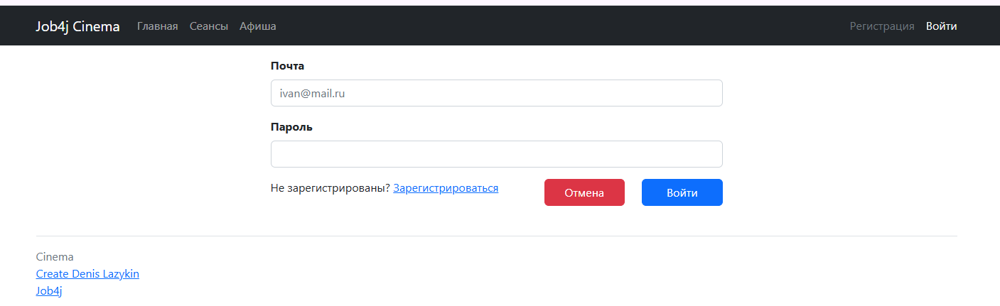

# Описание задачи:

Цель проекта - разработка веб-приложения для покупки билетов в кинотеатр. Основной функционал включает:
+ Регистрацию и вход пользователей;
+ Просмотр расписания киносеансов и информации о фильмах;
+ Покупку билетов с проверкой занятости мест.
Данные сохраняются в базе данных PostgreSQL.

# Используемые технологии:
+ Java 17
+ Spring Boot
+ Thymeleaf
+ Bootstrap
+ H2 Database
+ PostgreSQL
+ Sql2o
# Окружение:
+ Java 17
+ PostgreSQL 16
+ Maven 3.8

# Запуск

1. Создайте базу данных
``` sql
CREATE DATABASE cinema
```

2. Клонируйте репозиторий
``` bash
git clone https://github.com/itlazykin/job4j_cinema
cd job4j_cinema
```

3. Соберите проект с помощью Maven:
``` bash
mvn clean install 
```

4. Запустите приложение:
``` bash
mvn spring-boot:run
```
После запуска, проект будет доступен по адресу: [http://localhost:8080](http://localhost:8080)

Взаимодействие с приложением:

1. Главная



2. Афиша



3. Покупка билета на фильм



4. Вход



5. Регистрация



#### Контакты для связи:
* Лазыкин Денис Андреевич;
* +7 926 888 23 28;
* @slimdenchi
